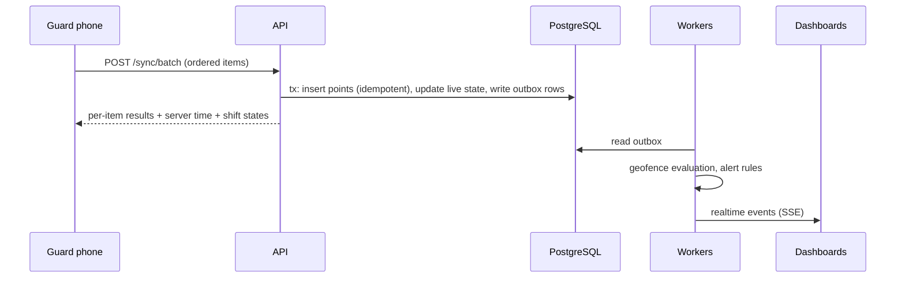
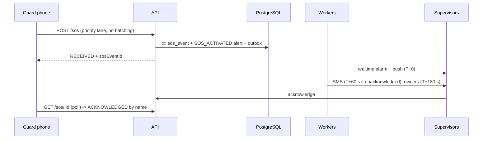

# Security Guard Operations & Tracking Platform
# ARCHITECTURE.md — How it works technically

| | |
|---|---|
| Spec revision | 2 |
| Date | 2026-10-08 |
| Approver | Product owner (Faraz) |
| Implementation agent | Claude Code |
| Audit agent | Fable |

---

## 0. Document set and working protocol

### 0.1 Document set (identical block in all three documents)

| Document | Answers | Section prefix |
|---|---|---|
| `PRODUCT_SPEC.md` | What the product does, for whom, with which rules and defaults | `PROD §` |
| `ARCHITECTURE.md` | How it works technically, how it is built, in which order | `ARCH §` |
| `SECURITY_AND_INVARIANTS.md` | What must never be allowed to happen, and how that is proven | `SEC §` |

**Precedence when documents disagree:** `SECURITY_AND_INVARIANTS.md` > approved decisions in `docs/DECISIONS.md` > `PRODUCT_SPEC.md` > `ARCHITECTURE.md` > implementation convenience. A conflict between two statements at the same level is a STOP condition (ARCH §0.3).

**Normative words:** MUST / MUST NOT = required (violation is a defect). SHOULD = expected; deviation needs a recorded reason. MAY = optional. "Default" = a configurable value from PROD Appendix B; never hard-coded.

**Identifiers:** `INV-nn` invariants (SEC §2) · `D-nn` decisions (appendices of each document; numbering is global) · `ADV-xnn` adversarial tests (SEC §18) · `EXT-nn` external dependencies and approvals (ARCH §20) · `A-nn` assumptions (PROD §2.3). Tests SHOULD carry the ID they prove in their name, e.g. `it("ADV-T01 org A user cannot read org B guard")`.

### 0.2 Claude Code working protocol

1. **One phase at a time** (ARCH §22). Never start a phase without explicit approval. Never implement the whole product in one pass.
2. **Phase start:** read the sections listed for the phase in all three documents. Write `docs/phases/phase-N/PLAN.md`: scope, schema changes, endpoints, screens, jobs, tests by ID, risks, open questions. If anything needs a decision marked OPEN → STOP and present options.
3. **During the phase:** stay inside the phase. No out-of-scope features (PROD §2.2). No new infrastructure component. No silent architecture change.
4. **Build a table when a fact needs it.** ARCH §6 is the target model; create tables in the phase that first needs them, not all up front.
5. **Invariants are enforced mechanically, not by prose.** Every invariant in SEC §2 is backed by a database constraint, a test, or a CI check. If you implement something an invariant governs and cannot point to the mechanism, the work is not done.
6. **Never weaken, skip or delete a failing test** to get CI green. A skipped test needs a linked reason in `docs/OPEN_QUESTIONS.md`.
7. **Never report something as tested that was not executed.** Real-device tests are run by humans; prepare checklists and instrumentation and mark them "pending human verification".
8. **Dependencies:** justify every new dependency in the phase report (purpose, alternatives, maintenance, licence, size, native permissions it adds). Prefer the platform and existing dependencies.
9. **Phase end:** full CI green; write `docs/phases/phase-N/REPORT.md` (what was built, deviations and reasons, tests by ID, known gaps, human checklist); update docs so they describe the code as it is (docs that describe a superseded design are defects).

### 0.3 STOP protocol

When an architectural decision is needed, when the spec is silent on anything touching tenancy, authorization, privacy, location integrity, SOS or retention, or when two statements conflict:

```text
STOP
DOCUMENT THE DECISION (context, options, trade-offs, recommendation) in docs/DECISIONS.md
PRESENT OPTIONS
WAIT FOR APPROVAL
```

For other gaps choose the simplest option consistent with the spec, record it in `docs/DECISIONS.md` tagged `agent-decided`, and list it in the phase report.

### 0.4 Repository documents to create and maintain

`CLAUDE.md` (condensed rules, commands, pointers to invariants) · `docs/PRODUCT_SPEC.md` · `docs/ARCHITECTURE.md` · `docs/SECURITY_AND_INVARIANTS.md` · `docs/DECISIONS.md` (ADR log) · `docs/THREAT_MODEL.md` · `docs/OPEN_QUESTIONS.md` · `docs/EXTERNAL_DEPENDENCIES.md` (live copy of ARCH §20 with status) · generated OpenAPI · `docs/RUNBOOKS/*.md` · `docs/testing/device-matrix.md` · `docs/phases/phase-N/{PLAN,REPORT}.md`.

---

## 1. System overview

### 1.1 Components

| Component | Responsibility |
|---|---|
| Mobile app (Expo) | guard mode (tracking, outbox, shifts, patrols, incidents, SOS) and supervisor mode (alerts, SOS acknowledgement) |
| API (Fastify) | the only gateway to the database; authentication, authorization, validation, business rules |
| Workers (same codebase, separate processes) | jobs, detectors, escalation, notifications, attachment processing, exports, retention |
| Web dashboard (Next.js) | UI only; talks to the API; never to the database |
| PostgreSQL | system of record; row-level security; job queue (D-11) |
| Object storage (S3-compatible, private) | incident photos, exports |
| External providers | identity (D-01), push (D-26), SMS (D-08), maps (D-12), error tracking |

### 1.2 Key flows





---

## 2. Technology stack

Every component has a reason. Nothing is added because it is fashionable.

| Concern | V1 choice | Reason |
|---|---|---|
| API | Node.js LTS, TypeScript (strict), Fastify | Revision 1 |
| Contracts | zod schemas in `packages/contracts`; OpenAPI generated from them | one source of truth for API, web and mobile |
| Database | PostgreSQL ≥ 16 managed; 18 preferred (native `uuidv7()`) | RLS, exclusion constraints, partitioning |
| Required extensions | `btree_gist` (no-overlap shifts), `citext`, `pgcrypto` | verify availability on the chosen provider (EXT-14) |
| DB access | Kysely or Drizzle (D-10) | explicit SQL and transactions; `SET LOCAL` per transaction; no ORM hiding tenant filters |
| Migrations | SQL-first, in `packages/db`, run by a dedicated migration role | reviewable; RLS policies and grants live in migrations |
| Jobs | pg-boss on PostgreSQL (D-11) | no extra infrastructure; jobs enqueued in the same transaction |
| Realtime | Server-Sent Events + PostgreSQL LISTEN/NOTIFY (D-09, D-11) | simplest viable; swap to Redis pub/sub only if measured need |
| Object storage | S3-compatible, private bucket | Revision 1 |
| Web | Next.js (App Router), client of the API | no direct DB access from Next.js |
| Mobile | Expo with development builds (EAS), config plugins, native modules where needed; Expo Go is not used | Revision 1; background location needs native config |
| Mobile local storage | SQLite (transactional) for the outbox; secure storage for tokens | durability across kills and reboots |
| Background location | decided by Phase 0B spike (D-07) | highest technical risk |
| Maps | Google Maps or Mapbox behind `MapProvider` (D-12) | Revision 1 §85 |
| Push | FCM + APNs (D-26) | |
| SMS | provider behind `SmsProvider` (D-08) | |
| Error tracking | Sentry-compatible with PII scrubbing | |
| Identity | mature provider (D-01) | never build password auth |

**Hosting constraint:** the API, SSE endpoint and workers run as long-lived processes (containers or VMs). Serverless functions are not suitable for SSE streams, LISTEN/NOTIFY listeners or pg-boss workers. The Next.js dashboard MAY be hosted anywhere.

**Connection-pooling constraint:** if a pooler in transaction mode is used, (a) tenant context must be set with `SET LOCAL` inside each transaction (session-level `SET` leaks between clients), and (b) LISTEN/NOTIFY needs a dedicated direct (non-pooled) connection per API instance.

---

## 3. Repository layout and module boundaries

```text
apps/api            Fastify API; workers entrypoint (separate process, same code)
apps/web            Next.js dashboard
apps/mobile         Expo app (guard mode + supervisor mode)
packages/contracts  zod schemas, enums, permission map, error codes, OpenAPI generation
packages/domain     pure logic, no IO: geofence, freshness, shift state machine,
                    checkpoint verification, capture-time estimation, alert rules, CSV escaping
packages/db         schema, migrations, RLS policies, grants, seed, test fixtures
packages/config     tsconfig, eslint, prettier
tools/simulator     fake-device CLI that drives the real sync API (staging, demos, load tests)
docs/
```

- `packages/domain` is used by the API, the web dashboard (freshness ticking) and the mobile app, so the same rule is never implemented twice.
- API modules: identity, tenancy, members, guards, devices, sites, patrols, shifts, tracking, incidents, attachments, sos, alerts, notifications, realtime, reports, exports, audit, settings, retention.
- Handlers are thin; services own transactions; repositories own SQL; domain functions are pure.
- All server code reads time from an injectable `Clock`. `Date.now()` / `new Date()` are banned in `packages/domain` and services (lint rule); tests use a fake clock.
- Lint MUST actually run in CI and fail on errors. A lint step that is a no-op is a defect.

---

## 4. Tenancy and authorization — implementation

Requirements are in SEC §4 and §6. This section is the mechanism.

### 4.1 Request context

```text
authenticate (provider JWT/session)
→ load user + ACTIVE memberships
→ choose organization:
     web: X-Organization-Id header, must match an ACTIVE membership
     mobile guard: the guard's single membership
→ load permissions for the role
→ context = { userId, orgId, role, permissions, guardId?, deviceId?, requestId }
```

`organization_id`, `guard_id`, `user_id` in bodies or query strings never establish identity or tenancy (INV-17).

### 4.2 Scoped data access

All access to tenant tables goes through repository functions that take the context and add `organization_id = :orgId`. Route handlers MUST NOT build SQL for tenant tables. A CI check flags raw SQL outside `packages/db` and repositories.

### 4.3 Row-level security

- Every tenant table: `ENABLE ROW LEVEL SECURITY` and `FORCE ROW LEVEL SECURITY`; policy `organization_id = current_setting('app.org_id', true)::uuid` for SELECT/INSERT/UPDATE/DELETE as applicable. A missing setting yields NULL → no rows (fail closed).
- Every request transaction begins with `SET LOCAL app.org_id = '<uuid>'` (and `app.user_id`).
- Roles:

| Role | Owns tables | Bypasses RLS | Used by |
|---|---|---|---|
| `migrator` | yes | n/a | migrations only |
| `app_runtime` | no | no | API and per-org jobs |
| `system_worker` | no | no; has explicit read-only cross-org policies on specific tables | cross-org sweeps that only enumerate work |
| `retention_worker` | no | explicit DELETE policies on retained tables | retention job |

- Tests run as `app_runtime`, never as a superuser or table owner (a superuser silently bypasses RLS and makes isolation tests pass falsely).
- Decide FORCE vs ENABLE deliberately per table and test the behaviour of every role against it. Any table without RLS is listed in `docs/DECISIONS.md` with the reason (e.g., `users`, which is global).

### 4.4 Composite foreign keys

Every tenant table has `UNIQUE (organization_id, id)`. Child tables reference parents with `(organization_id, parent_id)`. The database therefore rejects a shift in organization A that points at a site in organization B even if application code is wrong (INV-13). Where two parents must share a site (route ↔ checkpoint), the key includes `site_id` too (ARCH §6.3).

### 4.5 Background jobs

Every job payload carries `organization_id`; the runner opens a transaction with `SET LOCAL app.org_id`. Cross-organization sweeps (detectors) run as `system_worker`, only select work items, and enqueue per-organization jobs that do the writes as `app_runtime`. System writes record `actor_type = SYSTEM`.

### 4.6 Permissions and route policies

- Permissions are strings (e.g., `shifts.write`, `location.history.read`). The role → permission map lives once in `packages/contracts` and implements PROD §3.2.
- Every route is declared in a registry with: method, path, required permission(s), resource loader and ownership rule, request and response schemas, rate-limit class, audit action. Unregistered routes cannot be mounted.
- A CI meta-test enumerates the registry and fails if any route lacks a policy or is missing from the cross-tenant test fixture list (ADV-A09).
- Resources in another organization return 404, not 403 (no existence leak).

### 4.7 Namespaces

Cache keys, pub/sub channels and object keys are prefixed with the organization: `org/{orgId}/incidents/{incidentId}/{attachmentId}/...`. Buckets are private; access only through short-lived signed URLs issued after authorization.

---

## 5. Identity, sessions and devices

### 5.1 Identity provider (D-01)

The provider handles identities only: email/password or passkeys for dashboard users, phone OTP for guards (D-02), verification, password reset, MFA, account disabling, session revocation, JWT signing-key rotation. **Organization membership, roles and permissions live in our database**, the single source of truth; the provider's own organization/role features are not used for authorization.

### 5.2 Dashboard sessions

HttpOnly secure cookies; MFA enforced for Owner and Administrator; silent renewal while the tab is open; blocking signed-out screen if renewal fails (PROD §14.7).

### 5.3 Mobile sessions

- Tokens in Keychain / Android Keystore (secure storage).
- Short-lived access token; refresh token valid ≥ 14 days so a long offline shift never loses identity.
- Capture continues offline even if the access token has expired; the outbox uploads after refresh.
- If refresh is impossible (revoked or disabled): stop tracking, keep the queue, show "Signed out by your organization — pending data cannot be sent".

### 5.4 Device registration

- On first launch the app generates an `installation_id` (random UUID kept in secure storage). Hardware identifiers are never used as identity.
- `POST /devices/register` binds installation to guard → server `device_id`. The app sends `X-Device-Id` on every request; the server checks the device is ACTIVE and belongs to the authenticated guard.
- Revocation reasons: REPLACED (pending uploads captured before revocation are accepted for 72 h), LOST / COMPROMISED / ADMIN (everything rejected).

### 5.5 Shared phones

The outbox is partitioned by (user, organization). One user's queue is never uploaded with another user's token. Switching user with pending data requires the first user to sync or explicitly confirm data loss.

---

## 6. Data model

### 6.1 Conventions

- Primary keys UUIDv7 generated by the database or API. The only client-generated IDs are `client_event_id` values, used solely as idempotency keys.
- Tenant tables: `organization_id uuid NOT NULL`, `UNIQUE (organization_id, id)`, RLS (ARCH §4.3), composite FKs (ARCH §4.4).
- All timestamps `timestamptz`, stored UTC. Mutable tables have `created_at`, `updated_at`; admin-editable tables add `created_by`, `updated_by`.
- Editable entities carry `version int NOT NULL DEFAULT 1` for optimistic concurrency (guards, sites, checkpoints, patrol_routes, shifts, incidents, alerts, sos_events, settings, members).
- Enums as PostgreSQL enum types or CHECK constraints; transitions enforced in `packages/domain`.
- Operational entities are never hard-deleted; they become INACTIVE/ARCHIVED.
- **Append-only tables** (runtime role has INSERT and SELECT only): `location_points`, `shift_events`, `checkpoint_visits`, `incident_events`, `alert_events`, `device_status_events`, `tracking_consents`, `audit_logs`. Only `retention_worker` deletes.
- Coordinates `double precision` with CHECK ranges; accuracy CHECK > 0.
- Emails `citext`; phones E.164.

### 6.2 Entity list

```text
organizations, organization_settings, org_sequences
users, organization_members, invitations
guards, guard_devices, push_tokens, tracking_consents
sites, checkpoints, patrol_routes, patrol_route_checkpoints, patrol_runs, checkpoint_visits
shifts, shift_events, shift_live_state
location_points, device_status_events
incidents, incident_events, incident_attachments
sos_events, alerts, alert_events, notification_deliveries
exports, audit_logs, outbox
```

Revision 1's `site_geofences` table is folded into `sites` (one circle per site in V1). A separate table is introduced only when polygons or multiple zones are approved.

### 6.3 Tables

Shorthand: `ts` = timestamptz; `→ X` = composite FK `(organization_id, x_id) → X(organization_id, id)`.

```text
organizations                (RLS: id = app.org_id)
  id, name, legal_name, status ACTIVE|SUSPENDED|CLOSED,
  timezone text NOT NULL (IANA), default_locale, created_at, updated_at

organization_settings
  organization_id PK → organizations, settings jsonb NOT NULL (validated by versioned zod schema),
  schema_version int, version int, updated_by, updated_at

org_sequences
  organization_id, name, next_value bigint; PK (organization_id, name)    -- incident reference numbers

users                        (global; no RLS; access only through services, never listed globally)
  id, auth_provider_user_id UNIQUE NOT NULL, email citext UNIQUE NULL, phone UNIQUE NULL,
  name, status ACTIVE|DISABLED, locale, created_at, updated_at
  CHECK (email IS NOT NULL OR phone IS NOT NULL)

organization_members
  id, organization_id, user_id, role OWNER|ADMIN|SUPERVISOR|DISPATCHER|GUARD,
  status INVITED|ACTIVE|DISABLED|REMOVED, version, created_at, updated_at
  UNIQUE (organization_id, user_id)

invitations
  id, organization_id, role, email NULL, phone NULL, guard_id NULL → guards,
  token_hash bytea UNIQUE, expires_at, accepted_at, accepted_by_user_id, revoked_at, created_by, created_at

guards
  id, organization_id, user_id NULL, employee_number, display_name, phone,
  status ACTIVE|INACTIVE|SUSPENDED|TERMINATED, preferred_locale, version, created/updated (+by)
  UNIQUE (organization_id, employee_number)
  UNIQUE (user_id) WHERE user_id IS NOT NULL                  -- A-04: one organization per guard user

guard_devices
  id, organization_id, guard_id → guards, installation_id uuid, platform IOS|ANDROID,
  manufacturer, model, os_version, app_version, status ACTIVE|REVOKED,
  revoked_reason REPLACED|LOST|COMPROMISED|ADMIN NULL, revoked_at, revoked_by, last_seen_at, created_at, updated_at
  UNIQUE (organization_id, installation_id)
  UNIQUE (guard_id) WHERE status = 'ACTIVE'                  -- D-05

push_tokens                  (user-scoped; accessed only by notification service)
  id, user_id, installation_id, provider FCM|APNS, token, status ACTIVE|INVALID, last_registered_at, created_at
  UNIQUE (provider, token)

tracking_consents            (append-only)
  id, organization_id, guard_id → guards, user_id, device_id → guard_devices,
  disclosure_version, locale, accepted_at, created_at

sites
  id, organization_id, name, client_name, address_line_1, address_line_2, city, state, postal_code,
  country (ISO 3166-1 alpha-2), timezone (IANA), latitude, longitude,
  geofence_radius_meters int CHECK (50..5000), status ACTIVE|INACTIVE|ARCHIVED, notes, version, created/updated (+by)

checkpoints
  id, organization_id, site_id → sites, name, description, latitude NULL, longitude NULL,
  verification_radius_meters int CHECK (10..500),
  qr_token_hash bytea UNIQUE NOT NULL,        -- HMAC-SHA256(pepper, token), ARCH §11.1
  qr_token_ciphertext bytea NOT NULL,         -- encrypted token for reprinting, ARCH §11.1
  qr_token_version int NOT NULL DEFAULT 1, qr_rotated_at,
  status ACTIVE|INACTIVE|ARCHIVED, version, created/updated (+by)
  UNIQUE (organization_id, site_id, id)

patrol_routes
  id, organization_id, site_id → sites, name, description, enforce_order bool DEFAULT false,
  interval_minutes int NULL (NULL = on demand), first_run_offset_minutes int DEFAULT 0,
  completion_window_minutes int, status, version, created/updated (+by)
  UNIQUE (organization_id, site_id, id)

patrol_route_checkpoints
  id, organization_id, site_id, patrol_route_id, checkpoint_id, sequence int, required bool DEFAULT true
  FK (organization_id, site_id, patrol_route_id) → patrol_routes(organization_id, site_id, id)
  FK (organization_id, site_id, checkpoint_id)   → checkpoints(organization_id, site_id, id)
  UNIQUE (patrol_route_id, sequence), UNIQUE (patrol_route_id, checkpoint_id)
  -- the database guarantees a route and its checkpoints share a site
  -- service rule: a checkpoint is in at most one scheduled route

shifts
  id, organization_id, guard_id → guards, site_id → sites,
  starts_at, ends_at, start_deadline_at,
  status SCHEDULED|ACTIVE|COMPLETED|MISSED|CANCELLED,
  actual_started_at, actual_ended_at,
  start_source APP_ONLINE|APP_OFFLINE_SYNCED|SUPERVISOR_MANUAL NULL,
  start_latitude, start_longitude, start_accuracy_m, start_distance_m,
  start_geofence_class INSIDE|OUTSIDE|UNCERTAIN|NO_FIX, start_device_id, start_flags text[],
  end_reason GUARD|GUARD_OFFLINE_SYNCED|SUPERVISOR_FORCE_END|AUTO_TIMEOUT|GUARD_DISABLED NULL,
  end_latitude, end_longitude, end_accuracy_m,
  cancelled_reason, notes, version, created/updated (+by)
  CHECK (ends_at > starts_at AND ends_at - starts_at <= interval '24 hours')
  EXCLUDE USING gist (guard_id WITH =, tstzrange(starts_at, ends_at) WITH &&) WHERE (status <> 'CANCELLED')

shift_events                 (append-only)
  id, organization_id, shift_id → shifts, type, actor_type GUARD|USER|SYSTEM, actor_user_id, device_id,
  client_event_id NULL, occurred_at (server), client_recorded_at NULL, payload jsonb, created_at
  UNIQUE (shift_id, client_event_id) WHERE client_event_id IS NOT NULL
  types: CREATED, UPDATED, REASSIGNED, CANCELLED, STARTED, START_REJECTED, ENDED, AUTO_ENDED,
         FORCE_ENDED, EXTENDED, MARKED_MISSED, REOPENED, ENTERED_SITE, LEFT_SITE,
         TRACKING_DEGRADED, TRACKING_RESTORED

shift_live_state             (projection; rebuildable from source tables; never the source of truth)
  shift_id PK, organization_id, guard_id, site_id,
  last_fix_latitude, last_fix_longitude, last_fix_accuracy_m, last_fix_captured_at, last_fix_point_id,
  last_contact_at,
  geofence_state INSIDE|UNCERTAIN|OUTSIDE_SUSPECTED|OUTSIDE_CONFIRMED|UNKNOWN,
  geofence_state_since, outside_since, outside_point_count,
  tracking_issues text[], battery_pct, is_charging, app_version, pending_queue_count, oldest_pending_at,
  updated_at

location_points              (append-only; high volume)
  id, organization_id, guard_id, shift_id NULL, sos_event_id NULL, device_id,
  client_event_id uuid NOT NULL,
  latitude, longitude, accuracy_m NULL, altitude_m, speed_mps, heading_deg,
  recorded_at   -- phone clock at capture, as reported (preserved, never overwritten)
  captured_at   -- server-estimated true capture time (ARCH §8.7); used for ordering and queries
  received_at   -- server receipt
  clock_status VERIFIED_MONOTONIC|DEVICE_CLOCK_ONLY|SKEWED,
  source TRACKING|SHIFT_START|SHIFT_END|CHECKPOINT|INCIDENT|SOS,
  provider GPS|NETWORK|FUSED|UNKNOWN, is_mock bool NULL, flags text[],
  app_version, sync_batch_id, created_at
  UNIQUE (device_id, client_event_id)          -- see ARCH §6.5 before partitioning

device_status_events         (append-only; short retention)
  id, organization_id, guard_id, device_id, shift_id NULL, client_event_id, recorded_at, received_at,
  location_permission ALWAYS|WHEN_IN_USE|DENIED|RESTRICTED|NOT_DETERMINED, precise_location bool,
  location_services_enabled bool, notifications_enabled bool, battery_pct, is_charging,
  power_save_mode bool, battery_optimization_exempt bool NULL, auto_time_enabled bool NULL,
  oem_steps_confirmed text[], app_version, os_version, pending_queue_count, oldest_pending_at,
  last_successful_sync_at
  UNIQUE (device_id, client_event_id)

patrol_runs
  id, organization_id, shift_id → shifts, guard_id, site_id, patrol_route_id → patrol_routes,
  sequence_no int, due_at, window_ends_at,
  status PENDING|IN_PROGRESS|COMPLETED|INCOMPLETE|MISSED|CANCELLED,
  started_at, completed_at, required_count, counted_count, unconfirmed_count, created_at, updated_at
  UNIQUE (shift_id, patrol_route_id, sequence_no)

checkpoint_visits            (append-only)
  id, organization_id, guard_id, shift_id NULL, checkpoint_id NULL (NULL when INVALID_QR),
  patrol_route_id NULL, patrol_run_id NULL, device_id, client_event_id,
  scanned_at_recorded, scanned_at (server-estimated), received_at,
  latitude, longitude, accuracy_m, fix_age_s, distance_m, is_mock,
  verification_status VERIFIED|LOCATION_UNCONFIRMED|OUTSIDE_RADIUS|WRONG_SITE|INVALID_QR|NO_ACTIVE_SHIFT|DUPLICATE,
  verification_reason, flags text[], counted bool, qr_token_version NULL, created_at
  UNIQUE (device_id, client_event_id)
  -- the scanned token itself is never stored

incidents
  id, organization_id, reference_number text NOT NULL, guard_id NULL, reported_by_user_id,
  shift_id NULL, site_id NULL, checkpoint_id NULL,
  type, severity, title (≤120), description (≤4000), latitude, longitude, accuracy_m,
  occurred_at, reported_at, received_at,
  status OPEN|ACKNOWLEDGED|RESOLVED, acknowledged_by, acknowledged_at, resolved_by, resolved_at,
  resolution_note, client_event_id NULL, device_id NULL, version, created_at, updated_at
  UNIQUE (organization_id, reference_number), UNIQUE (device_id, client_event_id)

incident_events              (append-only)
  id, organization_id, incident_id → incidents,
  type CREATED|NOTE_ADDED|STATUS_CHANGED|SEVERITY_CHANGED|TYPE_CHANGED|ATTACHMENT_ADDED|ATTACHMENT_REJECTED,
  actor_type, actor_user_id, body (≤4000), from_value, to_value, created_at

incident_attachments
  id, organization_id, incident_id → incidents, client_event_id,
  original_storage_key, view_storage_key, mime_type (from magic bytes), size_bytes, width, height,
  sha256, capture_source IN_APP_CAMERA|GALLERY, exif_captured_at NULL, exif_latitude NULL, exif_longitude NULL,
  status PENDING_UPLOAD|PROCESSING|AVAILABLE|REJECTED, rejection_reason, created_at
  UNIQUE (incident_id, client_event_id)

sos_events
  id, organization_id, guard_id, shift_id NULL, device_id, client_event_id,
  activated_at_recorded, activated_at (server-estimated), received_at,
  latitude NULL, longitude NULL, accuracy_m NULL,
  status ACTIVE|ACKNOWLEDGED|RESOLVED, guard_cancel_requested_at NULL,
  notified_at NULL, acknowledged_by, acknowledged_at, resolved_by, resolved_at,
  resolution GENUINE|FALSE_ALARM|ACCIDENTAL|DRILL|OTHER NULL, resolution_note,
  is_drill bool DEFAULT false, alert_id, version, created_at, updated_at
  UNIQUE (device_id, client_event_id)
  UNIQUE (guard_id) WHERE status IN ('ACTIVE','ACKNOWLEDGED')   -- one open SOS per guard

alerts
  id, organization_id, type, severity LOW|MEDIUM|HIGH|CRITICAL,
  status OPEN|ACKNOWLEDGED|RESOLVED|DISMISSED, dedupe_key text NOT NULL,
  summary (server-generated plain text),
  guard_id, site_id, shift_id, checkpoint_id, patrol_run_id, incident_id, sos_event_id (nullable, composite FKs),
  opened_at, last_triggered_at, trigger_count int,
  acknowledged_by, acknowledged_at, resolved_by NULL (system), resolved_at,
  resolution_type MANUAL|CONDITION_CLEARED|SHIFT_ENDED|SUPERSEDED NULL,
  dismissed_by, dismissed_at, dismiss_reason,
  escalation_level int DEFAULT 0, next_escalation_at NULL, detected_late bool DEFAULT false,
  version, created_at, updated_at
  UNIQUE (organization_id, dedupe_key) WHERE status IN ('OPEN','ACKNOWLEDGED')

alert_events                 (append-only)
  id, organization_id, alert_id → alerts,
  type OPENED|RETRIGGERED|REOPENED|ACKNOWLEDGED|ESCALATED|NOTIFIED|SEEN|RESOLVED|AUTO_RESOLVED|DISMISSED|NOTE,
  actor_type, actor_user_id, note, payload jsonb, created_at

notification_deliveries      (status updated by workers and provider callbacks; never deleted except retention)
  id, organization_id, recipient_user_id, alert_id NULL, sos_event_id NULL, type,
  channel PUSH|SMS|EMAIL, status QUEUED|SENT|DELIVERED|FAILED|SUPPRESSED, dedupe_key UNIQUE,
  attempt int, provider, provider_message_id, error_code, created_at, sent_at, delivered_at, failed_at

exports
  id, organization_id, requested_by, type, params jsonb, status QUEUED|RUNNING|READY|FAILED|EXPIRED,
  storage_key, row_count, error_code, expires_at, created_at, completed_at

audit_logs                   (append-only)
  id, organization_id NULL (NULL only for platform-level events), actor_type USER|SYSTEM|PLATFORM_OPERATOR,
  actor_user_id, action, resource_type, resource_id, reason NULL, request_id, ip_address inet,
  user_agent, metadata jsonb, created_at

outbox                       (internal)
  id, organization_id, topic, payload jsonb, created_at, processed_at NULL, attempts int
```

### 6.4 Indexes (validate against EXPLAIN on realistic volume; do not index every column)

```text
location_points        (organization_id, guard_id, captured_at); (shift_id, captured_at); UNIQUE (device_id, client_event_id)
shifts                 (organization_id, starts_at); (guard_id, starts_at);
                       (organization_id, status, starts_at) WHERE status IN ('SCHEDULED','ACTIVE')
shift_live_state       (organization_id)
alerts                 (organization_id, status, created_at); (next_escalation_at) WHERE status = 'OPEN'
incidents              (organization_id, created_at); (organization_id, status)
checkpoint_visits      (shift_id, scanned_at); (checkpoint_id, scanned_at)
patrol_runs            (organization_id, status, window_ends_at)
audit_logs             (organization_id, created_at); (organization_id, resource_type, resource_id)
notification_deliveries (status, created_at) WHERE status = 'QUEUED'
outbox                 (created_at) WHERE processed_at IS NULL
```

Performance verification uses a dedicated environment seeded with ≥ 10 million location rows.

### 6.5 Partitioning (design for it; do not build it prematurely)

- `location_points` and `device_status_events` are designed so monthly range partitioning on `captured_at` / `received_at` can be added when volume requires (roughly > 100 M rows, or retention deletes become expensive). `captured_at` is safe as a partition key because ingestion bounds it to the shift window and the maximum offline age.
- **Trap:** a PostgreSQL unique index on a partitioned table must include the partition key, and `captured_at` is not identical across retries of the same event. When partitioning is introduced, idempotency moves to a separate non-partitioned `ingest_keys (device_id, client_event_id, received_at)` table checked in the same transaction (retained ≥ max offline age + margin).
- Dropping partitions implements the global maximum retention; shorter per-organization retention uses batched deletes.

### 6.6 ERD

Phase 0 generates a Mermaid ERD from the schema into `docs/ARCHITECTURE.md`, regenerated whenever migrations change.

---

## 7. Shift engine

- The state machine (PROD §6.3) is a pure function in `packages/domain`: `transition(shift, command, actor, now, settings) → { newState, events, effects } | error`. Unit tests are table-driven over every (state × command × actor) combination (ADV-SH01).
- Each transition runs in one transaction: lock the shift row (`SELECT … FOR UPDATE`) or compare `version`, apply, insert `shift_events`, insert `audit_logs` when the actor is a user, insert outbox rows (patrol run generation, live-state creation, realtime, alert evaluation).
- Commands from phones carry a `client_event_id`; a repeat returns the original outcome (ADV-SH02).
- `start_deadline_at` = `starts_at + shift.missed_after_minutes`, recomputed on edit; set to `ends_at` on reopen.
- Online guard start uses server receipt time as `actual_started_at` (INV-07). Offline-synced start uses `captured_at` (ARCH §8.7) with `start_source = APP_OFFLINE_SYNCED`; if `clock_status` is not `VERIFIED_MONOTONIC` the start is flagged.
- Detectors (ARCH §16): late/missed every 60 s; auto-end and overrun every 60 s. Each compares timestamps against `now` (catch-up safe), never assumes it ran on every tick.
- Bulk create: domain function expands the weekly pattern in the site timezone into instants (DST-correct via IANA zones), validates each row, returns a preview; commit inserts all rows in one transaction (exclusion constraint is the final guard against overlaps).

---

## 8. Mobile location subsystem

### 8.1 Library choice (D-07) — decided by evidence

Phase 0B builds the same minimal tracker with each candidate and measures it on real devices:

| Candidate | Notes |
|---|---|
| `expo-location` background updates + `expo-task-manager` | free; less control over Android foreground-service behaviour and heartbeats; reliability on aggressive manufacturer builds must be proven |
| `react-native-background-geolocation` (Transistorsoft) | mature motion detection and persistence; Android release builds require a paid licence per app (EXT-12); evaluate using it for capture only, with our own outbox and sync protocol |
| Custom native modules (Kotlin foreground service + Fused Location Provider; Swift CLLocationManager) via the Expo Modules API | maximum control, highest effort |

Criteria: 12-hour overnight gap count and duration per matrix device, battery %/hour, data MB per shift, survival after swipe-away / kill / reboot, permission-change detection, availability of monotonic timestamps and mock flags, licence and maintenance.

Whatever is chosen sits behind a `LocationSource` interface. Our outbox and sync protocol (ARCH §8.6) is the contract; the library is replaceable.

### 8.2 Platform configuration

**Android**
- Foreground service of type `location` while a shift (or SOS) is active: `FOREGROUND_SERVICE` + `FOREGROUND_SERVICE_LOCATION` permissions, declared service type, Play Console foreground-service declaration (EXT-04). Started from a user action in the foreground.
- Persistent, non-dismissible notification: "Shift active — sharing location with ‹Organization› until your shift ends".
- Fused Location Provider, high accuracy when moving. Record mock status (`Location.isMock()` on API 31+, older equivalent below).
- `RECEIVE_BOOT_COMPLETED` to resume an active shift after reboot where the platform allows starting a location foreground service from the background for our target SDK (verify during Phase 0B; if not allowed, post a notification asking the guard to reopen the app, and let stale/offline detection surface the gap).
- Do not depend on exact alarms (`SCHEDULE_EXACT_ALARM` is restricted on recent Android). The local end-of-shift failsafe is checked on every location callback and heartbeat.

**iOS**
- `UIBackgroundModes: location`; `allowsBackgroundLocationUpdates = true`; **`pausesLocationUpdatesAutomatically = false`** (stationary guards must not be paused); `showsBackgroundLocationIndicator = true`.
- Accuracy best / nearest-ten-metres; distance filter from settings. Evaluate `CLLocationUpdate.liveUpdates` and `CLBackgroundActivitySession` (iOS 17+) in Phase 0B.
- Significant-location-change monitoring as a relaunch safety net.
- Record `sourceInformation.isSimulatedBySoftware` (iOS 15+).
- Known limit to verify per iOS version: after the user force-quits the app, background tracking stops until the app is reopened. Stale/offline detection makes this visible to supervisors; on reopen the app reports the interruption window.

Usage strings: `NSLocationWhenInUseUsageDescription`, `NSLocationAlwaysAndWhenInUseUsageDescription`, `NSLocationTemporaryUsageDescriptionDictionary`, `NSCameraUsageDescription` — specific to this product.

### 8.3 Sampling

Implements PROD §8.2 from settings delivered by `GET /mobile/config`. Start, end, checkpoint, incident and SOS take an on-demand fix (wait ≤ 10 s for target accuracy, keep the best).

### 8.4 Heartbeats and device status

While a shift is active and the phone is online, a HEARTBEAT item is sent every 60 s even without a new point. DEVICE_STATUS items are sent immediately on change (permission, precise/approximate, location services, power saver, notifications, battery thresholds) and with every heartbeat as a compact delta.

### 8.5 Sync cadence

Upload every `sync.upload_interval_s` when online; immediately for SOS, start, end, scans and incidents. Failure → exponential backoff with full jitter (base 5 s, cap 5 min). A network-regained event triggers a flush, but **success is judged only by a completed request with a server response**, never by the OS "connected" flag (captive portals and dead data connections report connected).

### 8.6 Outbox

- SQLite in app-private storage, transactional writes. Survives app kill, OS kill, reboot and app update (local schema migrations are tested — ADV-O08). Never in-memory or AsyncStorage.
- Partitioned by (user, organization).
- Row: `seq` (monotonic local integer), `client_event_id` (UUIDv7), `type`, `shift_ref`, `payload`, `recorded_at`, `mono_ms`, `boot_id`, `attempts`, `next_attempt_at`, `status`, `last_error`.
- **Lanes**
  - SOS lane: `SOS`, `SOS_LOCATION`, `SOS_CANCEL_REQUEST`. Sent immediately and independently; never behind other items.
  - Main lane: `SHIFT_START`, `LOCATION`, `HEARTBEAT`, `DEVICE_STATUS`, `CHECKPOINT_SCAN`, `INCIDENT`, `INCIDENT_NOTE`, `SHIFT_END`. Sent in `seq` order, **one batch in flight at a time**, so the server sees a shift's START before its points and its points before its END.
  - Upload lane: incident photos (ARCH §12), after the incident is acknowledged.
- **Per-item results** from the server: `ACCEPTED` | `DUPLICATE` (treated as accepted) | `REJECTED` (permanent, with code) | `RETRY` (transient). The phone deletes ACCEPTED, DUPLICATE and REJECTED items; REJECTED is logged to diagnostics and shown when meaningful (e.g., `START_REJECTED`). Whole-batch failure (network, 5xx, 429) → retry the same batch with the same IDs.
- **Limits:** batch ≤ 500 items and ≤ 512 KB compressed. Items older than `sync.max_offline_age_hours` are dropped (the server would reject them). If queued location items exceed 20,000, the oldest are thinned to one per 60 s. SOS, start, end, scans and incidents are never dropped or thinned.

### 8.7 Time and clock integrity

- Every item carries `recorded_at` (phone wall clock, ms), `mono_ms` (a monotonic clock that keeps counting during deep sleep: Android `SystemClock.elapsedRealtime*` / `Location.getElapsedRealtimeNanos()`; iOS a continuous clock such as `mach_continuous_time` — verify in Phase 0B) and `boot_id` (Android `Settings.Global.BOOT_COUNT`; iOS derived from boot time).
- Every batch carries `sent_mono_ms` and `boot_id`.
- Server estimate:
  - same boot → `captured_at = received_at − (sent_mono_ms − item.mono_ms)`, `clock_status = VERIFIED_MONOTONIC`;
  - different boot → `captured_at = recorded_at` corrected by the last measured offset for that device, `clock_status = DEVICE_CLOCK_ONLY`;
  - `|recorded_at − captured_at| > 120 s` → flag `SKEWED_CLOCK`, raise the `CLOCK_SKEW` tracking issue.
  - `captured_at` is clamped to ≤ `received_at`.
- Every response carries `X-Server-Time`; the app warns when its clock is more than 2 min off.
- If the chosen library cannot supply per-fix monotonic timestamps, record `mono_ms` at callback time and document the added error.

### 8.8 Lifecycle and failsafes

- Tracking starts only after a START (local or server) and stops on: END tapped; local deadline (`ends_at + auto_end_after`); server reports the shift not ACTIVE; sign-out; guard disabled; device revoked.
- On launch, foreground and every heartbeat response the phone reconciles its local shift state with the server; **server state wins**.
- Permission or service changes → immediate DEVICE_STATUS item and an in-app/notification prompt to fix.
- After reboot or app update during a shift, tracking resumes where the platform permits; otherwise the guard is prompted and the gap is reported.

### 8.9 Spoofing evidence (collected, never claimed as proof)

`is_mock`, provider, accuracy, implied speed and jumps, clock status, and root/jailbreak heuristics (flag only, D-29). Surfaced as flags and `SUSPICIOUS_LOCATION` alerts.

### 8.10 Budgets (targets to measure in Phase 0B and Phase 4)

- Battery: ≤ 3% per hour with screen off on a mid-range Android during an active shift.
- Mobile data: ≤ 5 MB per 12-hour shift excluding photos.
If not met, adjust sampling before building more features.

### 8.11 On-device data

Queue in app-private storage, deleted after acknowledgement. No location in device logs or crash reports. Tokens in secure storage. Local database encryption: D-27.

---

## 9. Ingestion pipeline

### 9.1 Endpoint

`POST /api/v1/sync/batch` accepts ordered main-lane items. SOS uses `POST /api/v1/sos` (and is also accepted inside a batch with the same idempotency key).

```json
{
  "batchId": "uuid",
  "sentAt": "2026-10-08T19:57:03.120Z",
  "sentMonoMs": 912334455,
  "bootId": "41",
  "items": [
    { "clientEventId": "…", "type": "SHIFT_START", "shiftId": "…", "recordedAt": "…", "monoMs": 912300000,
      "fix": { "lat": 24.8607, "lon": 67.0011, "accuracyM": 8, "isMock": false, "provider": "FUSED" },
      "permission": { "location": "ALWAYS", "precise": true } },
    { "clientEventId": "…", "type": "LOCATION", "shiftId": "…", "recordedAt": "…", "monoMs": 912310000,
      "fix": { "lat": 24.8608, "lon": 67.0013, "accuracyM": 6, "speedMps": 1.1, "headingDeg": 90 } }
  ]
}
```

Response: `{ serverTime, results: [{ clientEventId, status, code? }], shifts: [{ shiftId, status, endsAt }], sos: [{ sosEventId, status, acknowledgedBy? }] }`.

Organization, guard and device come from the authenticated context and `X-Device-Id`, never from the body.

### 9.2 Per-item validation (in order)

1. Schema and ranges (SEC §8).
2. Device ACTIVE and owned by the guard (REPLACED: accept items captured before revocation for 72 h; LOST / COMPROMISED / ADMIN: reject all).
3. Shift belongs to the guard (else REJECTED `NOT_FOUND`).
4. Time: compute `captured_at` (ARCH §8.7); `received_at − captured_at` ≤ max offline age (else `TIMESTAMP_TOO_OLD`).
5. **Shift window:** for LOCATION, `captured_at` ∈ [actual start − 60 s, (actual end or now) + 60 s]; otherwise REJECTED `OUTSIDE_SHIFT_WINDOW` and **not stored** (INV-08). START/END follow ARCH §7. Exception: SOS-linked points while the guard has an open SOS (`captured_at ≥ activated_at`).
6. Accuracy: null → flag `ACCURACY_UNKNOWN`; > 50,000 m → REJECTED; otherwise stored, with `LOW_ACCURACY` when > the usable threshold.
7. Plausibility: implied speed from the previous accepted point > 70 m/s → flag `IMPLAUSIBLE_SPEED`.

Points captured during a shift but uploaded after the shift completed are **accepted** (ADV-L05). Items within a batch are processed in order, so a START earlier in the batch applies before that shift's points.

### 9.3 Write path

One transaction per batch (chunks of ≤ 500):
- insert with `ON CONFLICT (device_id, client_event_id) DO NOTHING` → DUPLICATE; if the stored row's content differs from the resubmission, keep the original, return DUPLICATE and increment `idempotency_conflict` (INV-05, INV-06);
- update `shift_live_state` by compare-and-set (only if newer `captured_at` / contact time);
- insert outbox rows (geofence evaluation, realtime);
- commit, then respond.

Target: p95 ≤ 300 ms for a 100-item batch.

### 9.4 Out-of-order data

- History is ordered by `captured_at`, never by insertion order or ID.
- Live state never moves backwards.
- Geofence evaluation per shift runs in `captured_at` order with a watermark. Points older than the watermark go through a backfill pass: an excursion that already ended is recorded as `LEFT_SITE`/`ENTERED_SITE` events with `detected_late = true` for history and reports, not as a live alert; a still-ongoing condition follows the normal rules.

### 9.5 Rate limits and backpressure

Per device: 60 requests/min sustained, burst 120 (SEC §9). On overload return `429` + `Retry-After`; the phone keeps its data. When the database is degraded, return `RETRY` rather than buffering in memory. SOS is never refused (INV-15).

---

## 10. Geofence, freshness and live state

- `packages/domain/geo`: haversine distance (WGS-84 mean radius; adequate for radii ≤ 5 km), point classification and the departure/return state machine from PROD §8.4, all pure and property-tested (e.g., a point with distance > radius is never INSIDE; adding accuracy never turns OUTSIDE into INSIDE).
- `packages/domain/freshness`: state from (now, last_contact_at, last_fix_at, settings). The same function runs in the freshness detector, the snapshot endpoint and the dashboard's local ticker (PROD §8.3).
- Geofence evaluator (worker, outbox-driven, one shift at a time, ordered): reads new points since the watermark, updates `shift_live_state.geofence_state`, writes `shift_events`, opens/resolves alerts. Geofence edits mid-shift reset the evaluation to use the new circle from the next point.
- `shift_live_state` is a projection that can be rebuilt from `location_points`, `device_status_events` and `shift_events` (a maintenance command exists and is tested).

---

## 11. Checkpoints and QR verification

### 11.1 QR tokens

- 128-bit random token from a CSPRNG, base64url (22 chars). QR content `SG1:<token>` (final prefix TBD): versioned, not a URL, no internal IDs.
- Lookup: `qr_token_hash = HMAC-SHA256(QR_TOKEN_PEPPER, token)`, unique-indexed. A slow password hash is unnecessary for 128-bit random tokens and would prevent indexed lookup.
- Reprinting: `qr_token_ciphertext` = token encrypted with a KMS/secret-manager key (AES-GCM); decrypted only by the print endpoint for Owner/Admin, audited (`CHECKPOINT_QR_PRINTED`).
- Rotation: new token, `qr_token_version + 1`, old token invalid immediately, audited.
- Pepper rotation: documented runbook; requires either reprinting all labels or a dual-hash lookup period (store `hash_v2` alongside `hash_v1` until relabelled).
- Tokens never appear in logs, analytics, error reports or audit metadata.

### 11.2 Verification (server; identical for online and offline-synced scans)

Input: token, scan `recorded_at`/`mono_ms`, fix (lat, lon, accuracy, fix age, is_mock), authenticated guard and device.

1. Look up `HMAC(token)`. Not found, archived, or another organization → `INVALID_QR` (identical response; never reveal existence).
2. Active shift covering scan `captured_at` → else `NO_ACTIVE_SHIFT`.
3. `checkpoint.site_id = shift.site_id` → else `WRONG_SITE`.
4. Same checkpoint already counted in the same run within `checkpoint.duplicate_window_s` → `DUPLICATE`. (Retrying the same `client_event_id` returns the original result, not DUPLICATE.)
5. Location:
   - checkpoint without coordinates, no fix, fix age > `checkpoint.max_fix_age_s`, accuracy > `checkpoint.max_usable_accuracy_m`, or mock under policy → `LOCATION_UNCONFIRMED`;
   - distance ≤ radius → `VERIFIED`;
   - distance − accuracy > radius → `OUTSIDE_RADIUS`;
   - otherwise → `LOCATION_UNCONFIRMED`.
6. Implied speed from the previous counting visit in the shift > `checkpoint.max_plausible_speed_mps` → flag `IMPLAUSIBLE_TRAVEL` and open/retrigger `SUSPICIOUS_LOCATION`.
7. `counted` = VERIFIED, or LOCATION_UNCONFIRMED when `patrol.count_unconfirmed_as_completed`.
8. Attach to the open run of the checkpoint's scheduled route whose window contains `captured_at`; update run counters and status.

Endpoint: `POST /api/v1/checkpoint-scans` with the token in the body. This replaces Revision 1's `POST /checkpoints/:id/verify`, which would have required the QR to contain an internal ID.

### 11.3 Patrol runs

Generated in the START transaction (outbox effect) for each scheduled route at the site; regenerated for future runs on extend or route change; closed by the patrol-run closer job (ARCH §16) and at shift end.

---

## 12. Attachments pipeline

1. Incident exists on the server (phone has the server ID).
2. `POST /incidents/:id/attachments` with `clientEventId`, declared type and size → `{ attachmentId, uploadUrl, headers, expiresAt }` — a presigned PUT, ≤ 15 min, constrained to content type and maximum length (15 MB).
3. Phone uploads a compressed JPEG (long edge ≤ 2,048 px, quality ≈ 0.8) from app-private storage; resumable via retry.
4. `POST /attachments/:id/complete` with `sha256`.
5. Worker verifies: object exists; size; magic bytes (JPEG, PNG, HEIC, WebP); pixel count ≤ 40 MP (decompression-bomb guard); sha256 match. Extracts EXIF capture time and GPS into columns. Produces a re-encoded view copy with metadata stripped. Status AVAILABLE or REJECTED.
6. Viewing: `GET /attachments/:id/url` → authorization → signed GET of the view copy, TTL ≤ 5 min. Original: `GET /attachments/:id/original-url`, Owner/Admin only, audited.

Keys: `org/{orgId}/incidents/{incidentId}/{attachmentId}/original` and `/view.jpg`. Malware scanning added if infrastructure policy requires (re-encoding already defuses most image-borne payloads).

---

## 13. SOS, alerts, escalation and notifications engines

### 13.1 SOS

`POST /sos` (idempotent by `client_event_id`):
- transaction: insert `sos_events` (or, if the guard already has an open SOS, add a RETRIGGERED alert event and update location), open `SOS_ACTIVATED` alert, set `next_escalation_at`, insert outbox rows (realtime, notifications);
- respond `{ sosEventId, status: RECEIVED }` immediately — notification fan-out is never inline.

`NOTIFIED` is set when the first of these is recorded: a notification delivery reaches `SENT` (provider accepted), or a dashboard/supervisor app reports display via `POST /alerts/:id/seen`.

Targets: p95 receipt → dashboard event ≤ 2 s; p95 receipt → first provider-accepted push ≤ 10 s.

### 13.2 Alert engine

- Alert rules are pure functions in `packages/domain/alerts` (inputs: event or detector state; output: open / retrigger / resolve intents with dedupe keys).
- The engine applies intents transactionally against the partial unique index on `(organization_id, dedupe_key)` for open alerts; reopen-within-suppression is handled by looking up the most recent resolved alert with the same key.
- Dedupe keys: `sos:{sosId}`, `incident:{id}`, `left_site:{shiftId}`, `tracking:{shiftId}`, `offline:{shiftId}`, `stale:{shiftId}`, `not_started:{shiftId}`, `missed:{shiftId}`, `patrol_run:{runId}`, `suspicious:{shiftId}`, `off_site_start:{shiftId}`, `overrun:{shiftId}`, `battery:{shiftId}`, `device:{deviceId}`.

### 13.3 Escalation engine

A job every 15 s selects OPEN alerts with `next_escalation_at ≤ now`, applies the organization's ladder step (PROD §11.4), creates notification deliveries, writes `ESCALATED`, sets the next step time. Acknowledgement clears `next_escalation_at`.

### 13.4 Notification engine

- Deliveries are rows; sending happens in workers via `PushProvider` / `SmsProvider` / `EmailProvider` interfaces.
- Idempotency: `dedupe_key = {alertId}:{recipientId}:{channel}:{escalationLevel}`; a retried job never double-sends.
- Retries: SOS — 3 attempts within 2 min; others — 5 within 30 min. Invalid push tokens are deactivated.
- Status meanings: QUEUED → SENT (provider accepted) → DELIVERED (provider receipt where available) | FAILED | SUPPRESSED (throttled or duplicate).
- Push priority: iOS `interruption-level: time-sensitive` for CRITICAL/HIGH; Android high-priority FCM data/notification messages on a dedicated high-importance channel with alarm sound for SOS. Critical Alerts only if the entitlement is granted (EXT-07).
- Non-production environments send SMS only to allow-listed numbers.

---

## 14. Realtime transport

- **SSE** (D-09): `GET /api/v1/stream`. Web authenticates with the HttpOnly session cookie (EventSource cannot set headers). If token auth is ever needed, use a single-use stream ticket (`POST /stream/tickets`, valid 30 s, bound to user + organization), never logged.
- On connect: resolve membership and permissions; attach the connection to the organization's topic server-side. Clients cannot name topics. Events are filtered per recipient permissions.
- Revalidation: on membership/role change or session revocation, an internal event closes that user's connections; all connections are cycled every 30 min to re-authenticate.
- Envelope: `{ id: "<orgSeq>", type, occurredAt, data }`, with a per-organization monotonic sequence. The server keeps a short replay buffer (5 min / 10,000 events per organization). If `Last-Event-ID` is outside the buffer, the server sends `resync`; the client reloads `GET /dashboard/snapshot`.
- Event types: `guard.state`, `alert.opened`, `alert.updated`, `sos.activated`, `sos.updated`, `incident.created`, `incident.updated`, `shift.updated`, `coverage.updated`. Payloads are minimal; details are fetched over REST.
- Fan-out: outbox → publisher → `NOTIFY` with IDs only (payload limit ~8 KB) → each API instance's dedicated listener connection → connections. Swap to Redis pub/sub only on measured need (D-11).
- Keep-alive comment every 25 s; `X-Accel-Buffering: no` and equivalent settings so proxies do not buffer.
- Monitoring coverage (PROD §11.5) = count of live dashboard connections + supervisor apps with a heartbeat in the last 2 min.
- Target: 500 concurrent dashboard connections in V1.

---

## 15. API conventions and endpoints

### 15.1 Conventions

- Base path `/api/v1`, from day one. JSON, camelCase. Timestamps RFC 3339 UTC with `Z`. IDs as UUID strings. Enums UPPER_SNAKE strings. Coordinates in degrees as numbers.
- Request headers: `Authorization` (mobile) or session cookie (web); `X-Organization-Id` (web, multi-organization users); `X-Device-Id`, `X-App-Version`, `X-Platform` (mobile); `Idempotency-Key` (SHOULD on web POSTs that create resources); `X-Request-Id` (generated if absent).
- Response headers: `X-Server-Time`, `X-Request-Id`.
- Pagination: opaque cursor; default 50, max 100; stable sort.
- Concurrency: editable resources return `version`; PATCH requires it; mismatch → 409 `VERSION_CONFLICT` with the current resource.
- Errors:

```json
{ "error": { "code": "SHIFT_NOT_ACTIVE", "message": "The shift is not currently active.",
             "requestId": "…", "details": [ { "path": "fix.accuracyM", "issue": "must be > 0" } ] } }
```

  400 `VALIDATION_FAILED` · 401 `UNAUTHENTICATED` · 403 `FORBIDDEN` (insufficient permission in own organization) · 404 `NOT_FOUND` (includes other organizations' resources) · 409 state/version conflicts · 422 business-rule violations · 426 `APP_VERSION_UNSUPPORTED` · 429 `RATE_LIMITED` · 500 `INTERNAL_ERROR` · 503 not ready. No stack traces. Codes in ARCH Appendix B.
- Schemas: zod in `packages/contracts`, strict (unknown fields rejected on mutations); OpenAPI generated and committed; CI fails on drift; web and mobile use generated types.

### 15.2 Mobile compatibility

- `GET /mobile/config` → `minSupportedVersion`, `recommendedVersion`, `revokedVersions`, `disclosureVersion`, tracking and sync parameters, feature flags, `serverTime`.
- Below the minimum the app shows an update screen, but uploads of already-captured data and SOS are still accepted unless the version is on the security-revoked list (INV-15).
- API changes within v1 are additive. Removing or changing a field requires ≥ 90 days' deprecation and a minimum-version bump. Every location event carries app version and device ID (Revision 1 §90).

### 15.3 Endpoint inventory (V1)

`[perm]` is the required permission; `audited` means an audit record is written.

**Session and configuration**
- `GET /me` — user, memberships, permissions [authenticated]
- `GET /mobile/config` [authenticated]

**Members and invitations**
- `GET /members` · `PATCH /members/:id` (role, status) [members.manage; owners.manage for owner/admin targets] audited
- `POST /invitations` · `GET /invitations` · `POST /invitations/:id/revoke` [members.manage] audited
- `POST /invitations/accept` [invitation token + authenticated user] audited

**Guards and devices**
- `GET /guards` · `POST /guards` · `GET /guards/:id` · `PATCH /guards/:id` · `POST /guards/:id/disable` · `POST /guards/:id/terminate` [guards.*] audited
- `GET /guards/:id/location` (live) [live.read]
- `GET /guards/:id/location-history?shiftId=|from=&to=&reason=` [location.history.read] audited before data is returned
- `POST /devices/register` [guard self] · `GET /guards/:id/devices` [devices.read] · `POST /devices/:id/revoke` [devices.revoke] audited
- `POST /push-tokens` · `DELETE /push-tokens/:id` [authenticated]
- `POST /tracking-consents` [guard self]

**Sites, checkpoints, patrols**
- `GET /sites` · `POST /sites` · `GET /sites/:id` · `PATCH /sites/:id` [sites.*] audited
- `GET /sites/:id/checkpoints` · `POST /sites/:id/checkpoints` · `PATCH /checkpoints/:id` · `POST /checkpoints/:id/rotate-qr` [checkpoints.write] audited
- `GET /sites/:id/checkpoints/print-sheet` [checkpoints.qr.print] audited
- `GET /sites/:id/patrol-routes` · `POST /sites/:id/patrol-routes` · `PATCH /patrol-routes/:id` [patrols.*] audited
- `GET /patrol-runs?shiftId=|siteId=&from=&to=` [patrols.read]
- `POST /checkpoint-scans` [guard self]

**Shifts**
- `GET /shifts` · `POST /shifts` · `POST /shifts/bulk?preview=true|false` · `GET /shifts/:id` · `PATCH /shifts/:id` [shifts.*] audited
- `POST /shifts/:id/start` · `POST /shifts/:id/end` [guard self]
- `POST /shifts/:id/cancel` · `/manual-start` · `/force-end` · `/extend` · `/reopen` [shifts.supervise] audited
- `GET /me/shifts` [guard self]

**Sync**
- `POST /sync/batch` [guard self]

**Incidents and attachments**
- `GET /incidents` · `POST /incidents` · `GET /incidents/:id` · `PATCH /incidents/:id` (severity, type) · `POST /incidents/:id/notes` · `POST /incidents/:id/status`
- `POST /incidents/:id/attachments` · `POST /attachments/:id/complete` · `GET /attachments/:id/url` · `GET /attachments/:id/original-url` (audited)

**SOS**
- `POST /sos` [guard self] · `GET /sos/:id` [guard own / sos.read] · `POST /sos/:id/cancel-request` [guard own]
- `POST /sos/:id/acknowledge` [sos.ack] · `POST /sos/:id/resolve` [sos.resolve] audited
- `POST /sos-drills` · `POST /sos-drills/:id/end` [sos.drill] audited

**Alerts**
- `GET /alerts` · `GET /alerts/:id` · `POST /alerts/:id/acknowledge` · `/resolve` · `/dismiss` · `/notes` · `/seen`

**Dashboard and realtime**
- `GET /dashboard/snapshot` (live states, open alerts, coverage, server time) · `GET /stream`

**Reports and exports**
- `GET /reports/attendance` · `/patrols` · `/incidents` · `/locations` · `/site-activity` [reports.read] (location report audited)
- `POST /exports` · `GET /exports/:id` · `GET /exports/:id/download` [exports.create] audited

**Audit and settings**
- `GET /audit-logs` [audit.read]
- `GET /settings` · `PATCH /settings` [org.settings.*] audited

**Operations**
- `GET /health` — process alive; no dependencies; no data
- `GET /ready` — database reachable, migrations at expected version, job system reachable

---

## 16. Background jobs and outbox

### 16.1 Transactional outbox

Side effects (realtime publish, notifications, alert evaluation, patrol-run generation, live-state creation) are written as `outbox` rows in the same transaction as the state change. A dispatcher moves them to pg-boss / NOTIFY. Delivery is at-least-once; every handler is idempotent.

### 16.2 Jobs

| Job | Cadence | Notes |
|---|---|---|
| Late / missed shift detector | 60 s | PROD §6.7 |
| Auto-end and overrun detector | 60 s | PROD §6.6 |
| Freshness detector (offline / stale alerts) | 60 s | `packages/domain/freshness` |
| Geofence evaluator | outbox-driven | ordered per shift, ARCH §10 |
| Patrol-run closer | 60 s | ARCH §11.3 |
| Alert escalation | 15 s | ARCH §13.3 |
| Notification sender | queue | retries, idempotent |
| Attachment processor | queue | ARCH §12 |
| Export generator | queue | PROD §15.2 |
| Retention | daily, 03:00 organization time | SEC §16.5 |
| Push-token cleanup | daily | |
| Demo shift refresher | daily | PROD §17 |
| Synthetic SOS canary | 5 min (production) | ARCH §18.4 |
| Partition maintenance | monthly, if partitioned | ARCH §6.5 |

Detectors are idempotent, tolerate missed runs (compare timestamps with `now`), batch per organization, and export lag metrics. Long-running work never depends on a web request staying open.

---

## 17. Maps

- `MapProvider` interface (Revision 1 §85): `renderMap`, `renderMarker`, `renderGeofence`, `renderRoute`, `cluster`, `geocode`. Web only in V1; the guard app needs no map tiles; supervisor mode uses a static map image or a deep link to the phone's maps app.
- Provider choice (D-12) after evaluating map data quality in launch cities, price at expected dashboard usage, and terms on storing geocoding results (pin-confirmed coordinates are user data; check the provider's terms anyway).
- Browser keys restricted by HTTP referrer and enabled APIs; quotas and budget alerts on; maps lazy-loaded.
- Popups use text APIs only (never `setHTML` / `dangerouslySetInnerHTML` with user content).

---

## 18. Observability and operations

### 18.1 Logs and errors

Structured JSON logs with `request_id`, `org_id`, `user_id` (IDs only); error tracking with scrubbing (SEC §15). Tracing optional.

### 18.2 Metrics

`location_upload_success_rate`, `location_upload_latency`, `ingest_items_total{status,code}`, `idempotency_conflict_total`, `offline_sync_backlog` and `oldest_pending_age` (from heartbeats), `active_shifts`, `stale_locations`, `offline_devices`, `tracking_issues{type}`, `geofence_departures`, `sos_events`, `sos_receipt_to_dashboard_ms`, `sos_receipt_to_first_notify_ms`, `sos_unacknowledged_open`, `notification_delivery_rate{channel}`, `job_lag_seconds{job}`, `outbox_backlog`, `sse_connections`, `monitoring_coverage{org}`, `api_error_rate`, `db_pool_saturation`, `clock_skew_devices`, `mock_location_flags`.

### 18.3 Targets (V1)

| Target | Value |
|---|---|
| API availability (ingest and SOS paths) | 99.9% monthly |
| SOS receipt → dashboard event | p95 ≤ 2 s |
| SOS receipt → first provider-accepted push | p95 ≤ 10 s |
| Sync batch (100 items) | p95 ≤ 300 ms |
| Detector lag | ≤ 2 min |
| Dashboard snapshot (500 active guards) | p95 ≤ 1 s |

### 18.4 Platform alerting and synthetic SOS

- Operator on-call alerts (not customer alerts): SOS pipeline errors, synthetic canary failure, notification provider failure rate > 5%, job lag > 2 min, ingest error rate > 2%, database health, certificate expiry, any organization with an SOS unacknowledged > 10 min (check delivery health).
- Synthetic canary: an internal organization; every 5 min a simulated device sends an SOS through the public API; the canary measures receipt, alert creation, realtime event and a push to an internal test device, then resolves it. Excluded from customer data and metrics.

### 18.5 Health

`/health` = alive; `/ready` = ready to serve (Revision 1 §69).

### 18.6 Mobile diagnostics

Device status events plus crash reporting without location or personal data (Revision 1 §92).

### 18.7 Runbooks (`docs/RUNBOOKS/`)

SOS notifications failing · notification provider outage · database restore · mass device offline · key rotation (QR pepper, QR encryption key, provider keys) · tenant data incident response · revoking an app version.

---

## 19. Environments, CI/CD, data and release

### 19.1 Environments

development · staging · production. Separate cloud projects/accounts, credentials, buckets, push and SMS credentials. Non-production SMS goes only to allow-listed numbers. Production location data is never used for development. Hosting region per D-13.

### 19.2 Staging

Test organizations, guards, sites, simulated shifts and alerts. The simulator scripts scenarios: "guard leaves site", "offline 30 min", "SOS while offline", "100 guards normal night", "reconnection storm".

### 19.3 CI on every pull request (a failing security test blocks merge)

typecheck · lint (must actually run) · unit · integration on real PostgreSQL in containers **as `app_runtime`** with RLS · security suite (cross-tenant, authorization, route-policy meta-test) · migration validation (empty database and seeded snapshot; down-migrations where defined) · OpenAPI drift · dependency audit · secret scanning · mobile typecheck/lint/unit · **native permission allow-list check** (merged AndroidManifest permissions and Info.plist usage keys must match an allow-list; a library that silently adds a permission fails CI) · build all apps.

### 19.4 Migrations

All schema changes via migrations; never manual production changes. Deterministic, reviewable, reversible where practical, tested. Expand/contract for anything older phones touch. RLS policies, grants and constraints are part of migrations. Data backfills are separate idempotent scripts.

### 19.5 Seed and demo

Deterministic seed: Demo Company with 10 guards, 5 sites (realistic coordinates and geofences), 20 shifts covering every state, 4 patrol routes, incidents, alerts, and simulator-generated tracks for completed shifts. Demo organization for development, QA and store reviewers, with no real people (PROD §17).

### 19.6 Backups and disaster recovery

Managed PostgreSQL with point-in-time recovery (RPO target ≤ 15 min), daily snapshots kept 35 days, encrypted; multi-AZ in production. Object storage versioning and lifecycle rules. RTO target ≤ 4 h. Restore drill before launch and quarterly. Single points of failure documented.

### 19.7 Mobile release

- EAS build profiles for development, staging and production with distinct bundle IDs and app names; a staging build cannot reach production.
- Staged rollout on Play and phased release on the App Store.
- Over-the-air updates only for JavaScript-only changes; never for native configuration, permissions or tracking behaviour that depends on native code.
- App version gating through `/mobile/config`.
- Every release: smoke test on 3 matrix devices (one Pixel-class, one aggressive-manufacturer Android, one iPhone).

---

## 20. External dependencies, approvals and platform constraints [R2]

Things outside the codebase that can block or reshape the product late. Phase 0 copies this register into `docs/EXTERNAL_DEPENDENCIES.md` with owner and status, and starts every long-lead item immediately. **Every item must be re-verified against the current official source when acted on; policies change.**

### 20.1 Approvals and accounts (human-owned; start in Phase 0)

| ID | Item | Why | Lead-time / risk | Needed by |
|---|---|---|---|---|
| EXT-01 | Legal-entity verification for developer accounts (e.g., D-U-N-S number for an organization enrolment) | Apple and Google organization accounts | days to weeks; blocks everything below | Phase 0B |
| EXT-02 | Apple Developer Program (organization) | iOS device builds, TestFlight, App Store | after EXT-01 | Phase 0B |
| EXT-03 | Google Play Console (organization) | Android distribution; personal accounts face extra closed-testing requirements before production (verify current rules) | identity verification lead time | Phase 4 |
| EXT-04 | Play foreground-service type declaration (location) | Android 14+ apps using a location foreground service | review; may need a video | before first Play track release |
| EXT-05 | Play background-location permission declaration | `ACCESS_BACKGROUND_LOCATION` is core | review with a video of the prominent disclosure and the feature; rejections are common; plan ≥ 2 cycles | before first Play track release |
| EXT-06 | Play Data safety form; current target-API-level requirement | listing requirement; target level deadlines recur yearly | moderate | Phase 10 |
| EXT-07 | Apple Critical Alerts entitlement | lets SOS alerts sound on silent iPhones | must be applied for; may be refused; product must not depend on it | apply in Phase 5 |
| EXT-08 | App Store review of background location and a login-gated B2B app | review notes, demo account | days; rejection risk | Phase 10 |
| EXT-09 | APNs key and Firebase project (FCM) | push | low | Phase 5 |
| EXT-10 | SMS provider with verified delivery to the launch country; sender ID / masking registration rules there (verify operator/regulator requirements) | SOS escalation, invitations | registration can take weeks; delivery quality varies by route | Phase 1 (invitations), Phase 8 |
| EXT-11 | Identity provider production instance with phone OTP enabled for the launch country, pricing tier for MFA and SMS, custom domain | guard sign-in | some providers restrict SMS by country | Phase 1 |
| EXT-12 | Background-location library licence (if D-07 selects a commercial library) | Android release builds | purchase tied to package name | Phase 4 |
| EXT-13 | Map provider billing account, restricted keys, quotas; terms on storing geocoded coordinates | dashboard maps | low | Phase 2 |
| EXT-14 | Cloud account and region (D-13); managed PostgreSQL version and extensions (`btree_gist`, `citext`, `pgcrypto`); PITR; direct connections for LISTEN/NOTIFY | core infrastructure | low, but a missing extension is an architectural dead end | Phase 0 |
| EXT-15 | Email sending domain with SPF, DKIM, DMARC; reputation warm-up | invitations, export notices | days to weeks | Phase 1 |
| EXT-16 | Public URLs for privacy policy, terms, support | store listings, disclosures | low | Phase 10 |
| EXT-17 | Legal review: data protection law in each operating country (for Pakistan, verify the status of personal data protection legislation at launch), employee-monitoring and labour rules, guard disclosure text in each language, retention defaults, data residency | lawful operation | weeks | before production data |
| EXT-18 | Expo Application Services plan and build quotas; signing credentials management | builds | low | Phase 0B |
| EXT-19 | Customer-side readiness: QR labels printed and installed, guard phones meeting minimum OS (D-20), guard mobile data | pilot | per customer | pilot |

### 20.2 Platform constraints that shape the design

| ID | Constraint | Design response |
|---|---|---|
| EXT-30 | Android 11+: background location is granted separately, through settings | two-step permission flow (PROD §7.3) |
| EXT-31 | Android 14+: foreground services need a declared type; Android 12+ restricts starting foreground services from the background | start tracking from a user action; verify reboot resume path in Phase 0B |
| EXT-32 | Android manufacturers (Xiaomi, Oppo/Realme, Vivo, Samsung, Huawei, Transsion brands) kill background apps beyond stock Android | guided setup, readiness check, device matrix, visible gaps |
| EXT-33 | Play policy restricts `REQUEST_IGNORE_BATTERY_OPTIMIZATIONS` to qualifying use cases | open the settings screen instead unless the policy is confirmed to allow it |
| EXT-34 | Play policy restricts `SEND_SMS` / `READ_SMS` to default SMS apps | phone opens the SMS composer; never sends in background |
| EXT-35 | Android 14+ restricts full-screen intents to calling/alarm apps (Play declaration) | do not plan full-screen SOS takeover on supervisor phones without verification |
| EXT-36 | Exact alarms are restricted on recent Android | failsafes checked on callbacks, not alarms |
| EXT-37 | Android 11+ revokes permissions of apps unused for months | readiness item; detect and prompt |
| EXT-38 | iOS: user force-quit stops background location until reopened | stale detection + interruption report |
| EXT-39 | iOS/Android silent, Do Not Disturb and Focus suppress ordinary notifications; iOS time-sensitive needs the capability and user consent; Critical Alerts need an entitlement | priority channels, setup test, SMS escalation, dashboard alarm, staffing (PROD §11.5) |
| EXT-40 | Browsers block audio until user interaction | "Enable alarm sound" control and warning |
| EXT-41 | Serverless platforms cannot host long-lived SSE streams, listeners or workers | long-lived processes for API and workers |
| EXT-42 | Transaction-mode connection poolers break session `SET` and `LISTEN` | `SET LOCAL` per transaction; dedicated listener connection |
| EXT-43 | PostgreSQL unique indexes on partitioned tables must include the partition key | separate ingest-key table when partitioning (ARCH §6.5) |
| EXT-44 | Expo Go cannot run background location; over-the-air updates cannot change native configuration | development builds; OTA policy (ARCH §19.7) |
| EXT-45 | Store policies on location, data safety and target API level change yearly | re-verify at each submission |

---

## 21. Testing strategy

Adversarial and security tests are specified in SEC §18. This section covers the rest.

### 21.1 Layers

- **Unit** — `packages/domain`: geofence, freshness, state machines, verification, capture-time estimation, alert rules, CSV escaping. Property-based tests (fast-check) for geometry and time estimation (e.g., `captured_at ≤ received_at` always; classification monotonic in distance).
- **Integration** — real PostgreSQL, `app_runtime` role, RLS on. Every endpoint: happy path, validation, authorization, cross-tenant.
- **Contract** — OpenAPI drift; web and mobile compile against generated types.
- **Time-travel** — fake clock for detectors, escalation ladders, auto-end, retention.
- **Mobile** — outbox ordering, acknowledgement handling, retries, thinning, user partitioning, local migrations; state reconciliation; readiness logic; simulated location sources.
- **End-to-end (staging)** — simulator scenarios plus browser tests of dashboard flows (SOS appears with alarm, acknowledgement, freshness transitions on the live map).

### 21.2 Load and performance

Simulate 2,000 active guards (mix of moving points every 30 s and stationary every 5 min, heartbeats every 60 s) for 1 h; a reconnection storm (500 devices each uploading a 60-minute backlog within 2 min); 200 SSE dashboard connections. Must meet ARCH §18.3 with no data loss and database CPU < 70%.

### 21.3 Real-device matrix (humans execute; results in `docs/testing/device-matrix.md`)

**Android:** Pixel-class (stock) · Samsung mid-range (One UI) · Xiaomi/Redmi (HyperOS/MIUI) · Oppo or Realme (ColorOS) · Vivo (Funtouch/OriginOS) · Infinix or Tecno (XOS/HiOS) · one low-RAM device · oldest supported Android version (D-20) and the latest.
**iOS:** current iPhone on the latest iOS · oldest supported iPhone/iOS (D-20).

**Scenarios:** foreground · background · screen locked · 12-hour overnight soak on battery with screen off · poor GPS (indoors/basement) · poor network · no network · captive Wi-Fi (connected but no internet) · battery saver / low-power mode · location services off · permission downgraded to "while using" mid-shift · precise → approximate mid-shift · notifications disabled · app swiped from recents · force-stop (Android) / force-quit (iOS) · device reboot mid-shift · app update mid-shift · manual clock change ±2 h · timezone change · low storage · SOS with screen locked · SOS in airplane mode, then reconnect.

**Record:** device, OS, build, scenario, result, gap count and longest gap, battery %/h, data MB, notes.

### 21.4 Initial tracking-reliability gate (refined after Phase 0B)

On each matrix device, correctly set up, over a 12-hour screen-off soak: no gap longer than 10 min while stationary or 5 min while moving, except where the OS or user stopped the app — in which case the gap is visible on the dashboard within `offline_after` + 1 min. Universal background reliability is never claimed beyond what was tested.

---

## 22. Implementation phases

Every phase delivers: schema + migrations, backend, frontend (web and/or mobile), tests (unit, integration, security), documentation and `REPORT.md`. Exit = listed tests pass in CI + human checklist signed off + product owner approval.

| Phase | Scope | Read | Exit tests |
|---|---|---|---|
| **0 Architecture** (no feature code) | repo skeleton, tooling, CI skeleton with real lint, `CLAUDE.md`, architecture doc with flows and ERD, `THREAT_MODEL.md`, permission map and route-policy mechanism, API conventions, error catalog, environments, `EXTERNAL_DEPENDENCIES.md` with long-lead items started, decisions presented; RLS proof-of-concept test showing a cross-tenant read blocked under `app_runtime` | all three docs | RLS PoC; CI runs |
| **0B Tracking spike** (parallel with 1; throwaway code; real devices) | minimal dev build per D-07 candidate: start/stop tracking, SQLite outbox, upload to a throwaway endpoint, device status, monotonic time, mock flag; 12-h soaks on ≥ 4 matrix devices; battery and data measured | ARCH §8, §20, §21.3 | recommendation for D-07 and sampling defaults approved |
| **1 Identity + tenancy** | identity provider, users, operator provisioning CLI, organizations, members, invitations, permissions, request context, RLS + composite-FK pattern, route registry + meta-test, audit service, settings service, `/me`, dashboard shell with sign-in and organization switch | PROD §3–4; ARCH §4–6; SEC §2, §4–6, §17 | ADV-T01, T06, T09, A02, A05, A06, A07, A09, W03 |
| **2 Guards + sites** | guards, guard invitations, mobile shell (sign-in, disclosure + consent, device registration, diagnostics), i18n setup, sites with map pin and geofence, checkpoints, QR generation / print / rotate, patrol route configuration | PROD §4–5, §7.1–7.3; ARCH §5, §11.1, §17 | ADV-T04, T05, A01, A10, Q05 |
| **3 Shifts** | CRUD, bulk create, state machine, online start/end, manual start / force-end / extend / reopen / cancel, late/missed/auto-end detectors, shift events, guard shift list, dashboard shift pages | PROD §6; ARCH §7, §16 | ADV-SH01–SH05, A03, T07, TM01, TM03 |
| **4 Mobile location subsystem** | chosen library, readiness check, permission flows, outbox and lanes, sync endpoint, idempotency, capture-time estimation, live state, heartbeats, device status, offline start/end, failsafes | PROD §6.5–6.6, §7.4–7.6, §8; ARCH §8–9 | ADV-L01–L12, O01–O08, A08, P01, U02, U03; device-matrix subset (human) |
| **5 Geofence + alerts** | geofence evaluator, freshness detectors, alert engine (catalog, dedupe, auto-resolve, reopen suppression), push notifications, supervisor mode alerts, basic alert UI | PROD §8.3–8.4, §12–13; ARCH §10, §13.2–13.4 | ADV-G01–G06, AL01–AL04 |
| **6 Live operations dashboard** | SSE, snapshot, live map, exception home with coverage, guard detail, location history viewer with audit | PROD §14; ARCH §14 | ADV-T02, A04, W01, P02, U01 |
| **7 Patrols** | run generation, scans online/offline, verification, run closer, patrol UI on mobile and web | PROD §9; ARCH §11 | ADV-Q01–Q09, T08 |
| **8 Incidents + SOS** | incidents with attachments, SOS end to end, escalation ladder, SMS, dashboard alarm, drill mode, synthetic canary | PROD §10–11; ARCH §12–13 | ADV-S01–S10, F01–F05, T10 |
| **9 Reports + exports** | all reports, background CSV exports, CSV safety, retention job with evidence preservation | PROD §15–16; SEC §16 | ADV-T03, W02, P03, P04, TM02 |
| **10 Hardening + launch** | full adversarial suite, full device matrix, load tests, restore drill, Fable audit and fixes, privacy and legal documents, store submissions, production deployment, runbooks verified | everything | PROD §18 Definition of Done |

Dependencies: 0 → (0B ∥ 1) → 2 → 3 → 4 (needs 0B) → 5 → 6 → 7 → 8 → 9 → 10.

---

## 23. Cost and scale

- Revision 1 example: 1,000 guards × 1 point/min × 8-hour shifts = 480,000 rows/day. At roughly 200–300 bytes per row including indexes that is about 100–150 MB/day, or roughly 10–14 GB at 90-day retention. 2,000 guards with 30-second moving intervals is 2–4× more.
- Controls: batched uploads; indexes validated by query plans; snapshot + SSE instead of querying the location table on every refresh; downsampling for map rendering; retention; partitioning when needed (ARCH §6.5).
- Maps are billed per dashboard map load, not per data refresh. SMS cost is bounded by the escalation ladder, throttles and the non-SOS cap. Push is free.

---

## Appendix A — Technical decisions

Status of all items: **OPEN** until the product owner approves.

| ID | Question | Options | Recommendation | Needed by |
|---|---|---|---|---|
| D-01 | Identity provider | Clerk · Auth0 · other mature provider | Clerk (identity only), after verifying phone OTP delivery and pricing in the launch country (EXT-11) | Phase 1 |
| D-07 | Background location implementation | expo-location · Transistorsoft · custom native | decide on Phase 0B evidence | Phase 4 |
| D-08 | SMS in V1 | yes (SOS escalation, invitations) · no | yes; provider chosen for verified delivery in the launch country (EXT-10) | Phase 1 / 8 |
| D-09 | Realtime transport | SSE · WebSocket | SSE | Phase 6 |
| D-10 | Database access and migrations | Kysely · Drizzle | either; must allow explicit transactions with `SET LOCAL` and SQL-first migrations | Phase 0 |
| D-11 | Jobs, pub/sub, rate-limit store | PostgreSQL only (pg-boss, LISTEN/NOTIFY, per-instance token buckets) · Redis (BullMQ, pub/sub, shared limits) | PostgreSQL only for V1 | Phase 0 |
| D-12 | Map provider | Google Maps · Mapbox | evaluate data quality in launch cities and cost | Phase 2 |
| D-13 | Hosting region and data residency | — | region close to users that satisfies any residency obligation from legal review | Phase 0 |
| D-19 | Organization provisioning and operator access | operator CLI · self-serve | operator CLI; documented break-glass (SEC §4.6) | Phase 1 |
| D-20 | Minimum OS versions | — | from launch-market device data and library support (e.g., Android 9/10+, iOS 16+); verify | Phase 0B |
| D-23 | V1 scale target | — | A-05 | Phase 0 |
| D-26 | Push delivery path | direct FCM/APNs · Expo push service | direct FCM/APNs (one fewer third party on the SOS path) | Phase 5 |

---

## Appendix B — Error codes

| Code | HTTP | Meaning |
|---|---|---|
| VALIDATION_FAILED | 400 | schema or range violation (details[] included) |
| UNAUTHENTICATED | 401 | missing or invalid credentials |
| FORBIDDEN | 403 | authenticated but lacks permission in own organization |
| NOT_FOUND | 404 | does not exist **or belongs to another organization** |
| ORG_CONTEXT_REQUIRED | 400 | multi-organization user omitted `X-Organization-Id` |
| ORG_SUSPENDED | 403 | organization suspended (SOS still accepted) |
| VERSION_CONFLICT | 409 | optimistic concurrency failure |
| SHIFT_INVALID_TRANSITION | 409 | transition not allowed from current state |
| SHIFT_OVERLAP | 409 | guard already has a shift in that period |
| SHIFT_NOT_ACTIVE | 409 | operation needs an ACTIVE shift |
| SHIFT_OUTSIDE_START_WINDOW | 422 | too early or after the start deadline |
| TRACKING_PERMISSION_REQUIRED | 422 | phone-reported permission insufficient under policy |
| LOCATION_FIX_REQUIRED | 422 | no fresh fix attached |
| STARTED_OFF_SITE_BLOCKED | 422 | start outside geofence when policy is BLOCK |
| OUTSIDE_SHIFT_WINDOW | 422 | location captured outside the shift window |
| TIMESTAMP_IN_FUTURE | 422 | capture time after receipt beyond tolerance |
| TIMESTAMP_TOO_OLD | 422 | beyond maximum offline age |
| DEVICE_NOT_REGISTERED | 403 | missing or unknown `X-Device-Id` |
| DEVICE_REVOKED | 403 | device revoked |
| INVALID_QR | 422 | unknown, rotated, archived or foreign QR |
| LAST_OWNER | 409 | would leave the organization without an owner |
| SELF_ROLE_CHANGE | 403 | attempt to change own role or status |
| INVITATION_EXPIRED | 410 | invitation expired, used or revoked |
| ATTACHMENT_TOO_LARGE | 413 | over size limit |
| ATTACHMENT_TYPE_NOT_ALLOWED | 415 | content does not match an allowed type |
| EXPORT_RANGE_TOO_LARGE | 422 | export range > 92 days |
| APP_VERSION_UNSUPPORTED | 426 | below minimum (not returned for SOS or queued uploads unless revoked) |
| RATE_LIMITED | 429 | with `Retry-After` |
| INTERNAL_ERROR | 500 | no internals exposed |
| NOT_READY | 503 | dependency unavailable |


