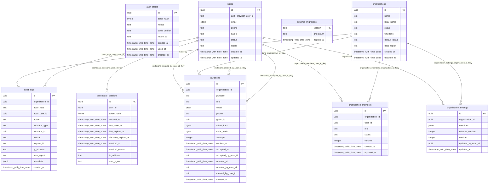

# Entity-relationship diagram

Generated from the migrated schema by `packages/db/src/erd.ts`; do not edit by hand.
Regenerate with `UPDATE_GENERATED=1 pnpm test --project db`.

```mermaid
erDiagram
  audit_logs {
    uuid id PK
    uuid organization_id
    text actor_type
    uuid actor_user_id
    text action
    text resource_type
    uuid resource_id
    text reason
    text request_id
    inet ip_address
    text user_agent
    jsonb metadata
    timestamp_with_time_zone created_at
  }
  auth_states {
    uuid id PK
    bytea state_hash
    text nonce
    text code_verifier
    text return_to
    timestamp_with_time_zone expires_at
    timestamp_with_time_zone used_at
    timestamp_with_time_zone created_at
  }
  dashboard_sessions {
    uuid id PK
    uuid user_id
    bytea token_hash
    timestamp_with_time_zone created_at
    timestamp_with_time_zone last_seen_at
    timestamp_with_time_zone idle_expires_at
    timestamp_with_time_zone absolute_expires_at
    timestamp_with_time_zone revoked_at
    text revoked_reason
    inet ip_address
    text user_agent
  }
  invitations {
    uuid id PK
    uuid organization_id
    text purpose
    text role
    citext email
    text phone
    uuid guard_id
    bytea token_hash
    bytea code_hash
    integer attempts
    timestamp_with_time_zone expires_at
    timestamp_with_time_zone accepted_at
    uuid accepted_by_user_id
    timestamp_with_time_zone revoked_at
    uuid revoked_by_user_id
    uuid created_by_user_id
    timestamp_with_time_zone created_at
  }
  organization_members {
    uuid id PK
    uuid organization_id
    uuid user_id
    text role
    text status
    integer version
    timestamp_with_time_zone created_at
    timestamp_with_time_zone updated_at
  }
  organization_settings {
    uuid id PK
    uuid organization_id
    jsonb overrides
    integer schema_version
    integer version
    uuid updated_by_user_id
    timestamp_with_time_zone updated_at
  }
  organizations {
    uuid id PK
    text name
    text legal_name
    text status
    text timezone
    text default_locale
    text data_region
    timestamp_with_time_zone created_at
    timestamp_with_time_zone updated_at
  }
  schema_migrations {
    text version PK
    text checksum
    timestamp_with_time_zone applied_at
  }
  users {
    uuid id PK
    text auth_provider_user_id
    citext email
    text phone
    text name
    text status
    text locale
    timestamp_with_time_zone created_at
    timestamp_with_time_zone updated_at
  }
  users ||--o{ audit_logs : "audit_logs_actor_user_id_fkey"
  organizations ||--o{ audit_logs : "audit_logs_organization_id_fkey"
  users ||--o{ dashboard_sessions : "dashboard_sessions_user_id_fkey"
  users ||--o{ invitations : "invitations_accepted_by_user_id_fkey"
  users ||--o{ invitations : "invitations_created_by_user_id_fkey"
  organizations ||--o{ invitations : "invitations_organization_id_fkey"
  users ||--o{ invitations : "invitations_revoked_by_user_id_fkey"
  organizations ||--o{ organization_members : "organization_members_organization_id_fkey"
  users ||--o{ organization_members : "organization_members_user_id_fkey"
  organizations ||--o{ organization_settings : "organization_settings_organization_id_fkey"
  users ||--o{ organization_settings : "organization_settings_updated_by_user_id_fkey"
```
